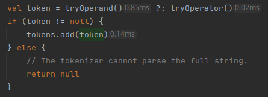

# Snapvis

**Snapvis** is an IntelliJ plugin that can load a CPU snapshot and display average method call times as hints for profiled method calls in Kotlin code.

## Features and Usage

#### Load and Clear Snapshots

The menu action **Tools→Snapvis→Load Snapshot** presents a file chooser with which you can select a CPU snapshot. Currently, only JFR snapshots are supported, such as those generated by async-profiler or IntelliJ. More formats might be supported in the future.

Once a snapshot has been loaded, the plugin automatically displays hints after method calls in Kotlin files that are part of the project. A hint has a minimum threshold of `0.01ms` to be displayed. If the average call time is less, or if no data exists for the method, a hint is not displayed.

The menu action **Tools→Snapvis→Clear Snapshot** removes all data and therefore all hints.

#### Interpreting Hints

The average call times displayed by the plugin are not absolute truths. You should be aware of your profiler's method of profiling. async-profiler, for example, is a wall-clock *sampling* profiler, which means that it saves a stack trace of each thread at some sampling rate. A sampling rate of, for example, 1ms will generate holes of roughly 1ms during which the snapshot doesn't contain information about the state of each thread's method stack. Reducing the sampling interval beyond 0.1ms is unwise, because sampling itself takes some time. 

This leads to the following issues:

- Calls to fast methods are usually missed altogether and no hint can be provided. Certainly the call time cannot be measured accurately.
- A method call that appears in two adjacent sample stack traces must be assumed to be the same call. However, in reality, the method might have been called multiple times during the sampling interval. The plugin then overestimates the actual call time of the method.

For example, in the screenshot above, we can deduce that `tryOperand` almost certainly takes more time than `tryOperator`. However, that `tokens.add` takes more time than `tryOperator` is dubious. And certainly, none of these methods take anywhere close to a full millisecond (refer to the [implementation](https://github.com/marcopennekamp/snapvis/blob/main/calculator/src/main/kotlin/calculator/Tokenizer.kt)), which means that the second issue is in play here. The piece of code in the screenshot is called many times in a loop, so the sample cannot distinguish between one call and many calls to the same method. 

Snapvis doesn't currently support instrumentation-based snapshots, but these will likely provide a more accurate picture of actual method call time. Instrumentation comes with its own issues, though, and even then, call times will not be 100% accurate.

#### Loading Up-to-date Snapshots

Snapvis can only map the files and lines in the snapshot to their method calls if the project's source code hasn't been changed yet. Therefore, always load a snapshot that has been created for the current state of your project.

Additionally, Snapvis makes no guarantees that hints will persist when a file is changed live. Currently, once line numbers become misaligned due to adding a new line in a file, all call time hints beyond that line become misaligned as well. This usually means that hints simply disappear, but in some cases the hints will be displayed in the wrong lines if the same method is called in the original line and the misaligned line. Making Snapvis usable for live editing is a target for future work. 

## Running and Testing

Snapvis provides IntelliJ run and test configurations in the folder `.run`:

- **Run Plugin** runs the plugin in a separate IntelliJ instance.
- **Test Plugin** executes Snapvis unit and headless IDE tests.

## Architecture

The heart of the plugin is a class [CallMetrics](src/main/kotlin/snapvis/metrics/CallMetrics.kt) which holds all method call times by line and class. It's managed for each project by the [MetricsService](src/main/kotlin/snapvis/metrics/MetricsService.kt).

The plugin then approaches CallMetrics from two angles:

1. An [Extractor](src/main/kotlin/snapvis/extractors/Extractor.kt)'s job is to read and analyze a CPU snapshot (e.g. a JFR snapshot) to *produce* call metrics.
2. The [CallTimeHintsProvider](src/main/kotlin/snapvis/hints/CallTimeHintsProvider.kt) and [CallTimeHintsCollector](src/main/kotlin/snapvis/hints/CallTimeHintsCollector.kt) *use* CallMetrics from the MetricsService to show call time hints in project files.

The actions [LoadSnapshotAction](src/main/kotlin/snapvis/actions/LoadSnapshotAction.kt) and [ClearSnapshotAction](src/main/kotlin/snapvis/actions/ClearSnapshotAction.kt) interact with the MetricsService to add or clear CallMetrics for the current project. LoadSnapshotAction additionally needs access to an Extractor so that CallMetrics can be produced from a snapshot.

Extractor is an interface, which makes it easy to add extractors for new snapshot formats. One simply has to define a new extractor and add a mapping to `Extractors.extractorByExtension`.

Snapvis also contains functional tests for the actions and the hints provider, as well as unit tests for the extractor and other utility functions.

## Future Work

This is a list of improvements that should or could be added to the plugin.

- JFR stack trace locations carry line numbers, but not column numbers. This makes it hard to differentiate between two calls to the same method on the same line. It is possible to use the bytecode index to disambiguate between two method calls. This requires the plugin to look into the bytecode. For the sake of simplicity, method calls are currently only grouped by line, which is inaccurate in edge cases.
  - Look into `org.jetbrains.kotlin.idea.internal.KotlinBytecodeToolWindow` as an example of how to compile a Kotlin file to bytecode. (Performance has to be taken into account here. The bytecode index needs to be queried on the inlay hint side, so the solution could be feasible if we cache the bytecode. The solution would not be feasible if we'd have to get and cache the bytecode for every profiled Kotlin file in the project.)
  - Also look into incorporating the method signature into the data.
- The current JFR extractor doesn't take thread state into account. This isn't much of an issue for single-threaded applications, but might misrepresent the non-idle execution time of methods in heavily threaded applications. I didn't have enough time within the scope of the assignment to dig into these issues, so this is a target for future work.
  - Note that [async-profiler measures wall clock time](https://stackoverflow.com/a/60160584) and thereby includes execution samples of idle threads. A distinction between idle and running was [added](https://github.com/jvm-profiling-tools/async-profiler/issues/279) to async-profiler a while ago.
- The Kotlin file to Java `.class` file mapping is not one-to-one. The snapshot might contain class names which need some processing until they are recognizable by the plugin, such as normalizing class names with `$` (e.g. `calculator.Tokenizer$tryOperand$1$2` to `calculator.Tokenizer`). Conversely, a Kotlin project file might contain package-level functions, which require special class name handling as per the [documentation](https://kotlinlang.org/docs/java-to-kotlin-interop.html#package-level-functions). To keep the task simple in this area, only absolutely necessary normalization and support for package-level functions has been implemented. This should be improved in the future.
  - Compiling the Kotlin file ad-hoc (see `org.jetbrains.kotlin.idea.internal.KotlinBytecodeToolWindow`) might lead to the proper class name straight from the compiler. (This has to be evaluated from a performance standpoint; see the other comment about analysing the bytecode above.)
- Support additional snapshot formats, especially from an instrumentation profiler (as noted above).
- Add an item to the right-click menu of the hint that also allows clearing the current snapshot, in addition to the Tools->Snapvis->Clear Snapshot action.
- When the caret is placed inside the method's name, additionally show minimum and maximum run time.
  - Whether this information is useful depends on the snapshot's profiling method. Minimum and maximum time will likely only be useful when taken from instrumentation, as sampling is too inaccurate.
- Add settings for absolute and relative thresholds. If a method call took less than x nanoseconds or less than x% of total time, hide the hint unless the caret is placed inside the method's name.
  - This contrasts the current approach of hiding any call times under 0.01ms (or rather 0.005ms rounded up).
- Add settings for call time formatting, or automatic formatting based on the call time (e.g. dynamic unit support like `2.2s`, `10.5ms`, `50µs`, and so on). By default, call times are formatted as `x.yyms` with a precision of two decimal places. Smaller numbers are not very useful with the JFR format because sampling intervals should be in the order of 10ms to 0.1ms. However, once instrumentation snapshot formats are supported, this extension will become mandatory.
